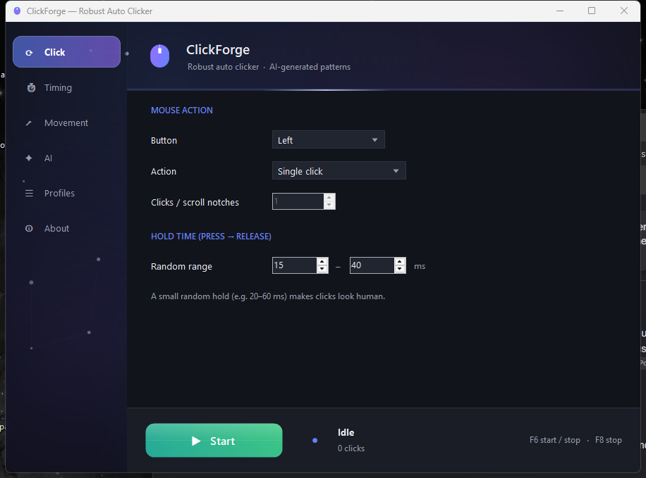

# mouseclicker.app

**A robust, no-install Windows auto clicker with AI-generated click & movement patterns.**

Tons of options for **how** to click, **where** to move the cursor, and **when** to fire — wrapped in a fully animated interface and packaged as a single ~100 KB portable executable that runs on any Windows 10/11 machine with **no install and no runtime download**. Free and open source under the MIT License.

🌐 **Website:** https://mouseclicker.app · ⬇ **[Download the latest .exe](https://github.com/stevologic/mouse_clicker/releases/latest/download/MouseClicker.exe)**



---

## Why it's different

- **Truly portable.** A single self-contained `.exe`. It runs on the .NET Framework that already ships with Windows — no installer, no admin rights, no 60 MB runtime bundle.
- **Extremely configurable.** Every click button and type, randomized hold/interval timing, four positioning modes, and three cursor-movement styles including humanized curves.
- **AI patterns, your choice of model.** Describe what you want in plain English and let **Claude, OpenAI, Gemini, Grok, or a lightweight local model** build the whole pattern. The local option runs fully offline via [Ollama](https://ollama.com) — no key, no cloud. Works with a built-in heuristic generator too.
- **Record & replay.** Hit Record and click anywhere on screen — mouseclicker.app captures each click's position, button, and timing, then replays the whole sequence a set number of times or on a loop.
- **Live activity HUD.** While a run is active, a sleek floating popup shows a pulsing indicator and a live click counter — always on top and click-through, so it never gets in the way.
- **A living interface.** A hand-built animated UI — a cursor-reactive particle constellation, an aurora backdrop, glassmorphism, and a glowing Start button — rendered entirely in GDI+. It idles to near-zero CPU when the window isn't in the foreground.
- **Tiny & fast.** ~100 KB, native input via the Win32 `SendInput` API, precise sub-millisecond timing.

## Features

### How to click
- **Buttons:** left, right, middle, and side buttons (X1/X2)
- **Actions:** single, double, triple, N-click bursts, scroll up/down, or press-and-hold / release
- **Human-like hold:** randomized press-to-release time range

### When to click
- Fixed or randomized interval between events (with a live CPS estimate and quick 5–100 CPS presets)
- Run **until stopped**, for a **fixed number of clicks**, or for a **duration**
- Configurable start countdown

### Where to click
- **Current cursor** — click wherever the pointer is
- **Fixed point** — with an on-screen coordinate picker
- **Random in a region** — spray clicks inside a rectangle
- **Point sequence** — walk a looping list of captured points
- **Movement:** teleport, linear glide, or **humanized** curved Bézier travel with easing and micro-jitter
- Optional target jitter and return-to-origin

### Record & replay
- **Record** your real mouse clicks system-wide — each click's position, button, and the timing between them
- **Play back** the sequence a fixed number of times or on a **loop**, faithfully reproducing the recorded pauses
- Clicks on the app's own window are ignored while recording, so the UI stays usable
- **Send to Movement points** to hand a recording to the point-sequence engine
- `F8` (or Stop) halts playback instantly

### Control
- System-wide **global hotkeys** (default `F6` = start/stop, `F8` = emergency stop) that work even in the background
- Save and load named **profiles**
- **Minimize to the system tray** to keep clicking in the background
- Every tab fits on screen with **no scrolling**
- Multi-monitor aware, DPI-aware (true physical-pixel coordinates)

### AI pattern generator
Type a description like:

> *"Click like a human every 1–3 seconds near the center of the screen, with slight random movement, for 5 minutes."*

…pick your provider — **Claude (Anthropic), OpenAI, Gemini (Google), Grok (xAI), or a local model** — and mouseclicker.app translates it into a precise, ready-to-run pattern. The model field is editable, so any current model id works.

- **Local, no key, no cloud:** select **Local (Ollama)** to run a lightweight model right on your machine. Install [Ollama](https://ollama.com), pull a tiny model (e.g. `ollama pull qwen2.5:0.5b`, ~400 MB), and generate patterns fully offline. Leave the key field blank for `http://localhost:11434` or point it at a custom server.
- **Cloud:** enter your own API key for Claude, OpenAI, Gemini, or Grok. Keys are stored locally under `%APPDATA%\MouseClicker` and sent only to the provider you choose.
- **No key or model at all?** A built-in **offline generator** and one-click **presets** (rapid fire, human idle jiggle, gentle clicks, region spray, double-click spam) have you covered.

## Get started

### Download & run
1. Download [`MouseClicker.exe`](https://github.com/stevologic/mouse_clicker/releases/latest/download/MouseClicker.exe).
2. Double-click it. That's it — no install.
3. Configure your options (or open the **AI** tab and describe what you want), then press **F6** to start/stop from anywhere.

### Build from source
You only need Windows — the C# compiler ships with the .NET Framework, so there's no SDK to install.

```powershell
git clone https://github.com/stevologic/mouse_clicker
cd mouse_clicker
powershell -ExecutionPolicy Bypass -File build.ps1 -Run
```

`build.ps1` locates the Framework `csc.exe`, generates the app icon, and compiles everything in `src/` into `MouseClicker.exe`. Or just run [`run.bat`](run.bat).

## How it works

| Area | Implementation |
| --- | --- |
| Clicking | Win32 `SendInput` for synthetic mouse buttons and wheel |
| Movement | `SetCursorPos` stepped along cubic Bézier paths with smootherstep easing |
| Timing | `Stopwatch`-based precision sleep blended with coarse sleep |
| Hotkeys | `RegisterHotKey` + `WM_HOTKEY`, handled in the form's `WndProc` |
| Recording | Low-level mouse hook (`WH_MOUSE_LL`) capturing real clicks; background thread replays them |
| AI | Anthropic / OpenAI / Google / xAI APIs, or a local model via the Ollama HTTP API (`localhost:11434`), with an offline heuristic fallback |
| Activity HUD | Topmost per-pixel-alpha layered window (`UpdateLayeredWindow`), click-through |
| UI | Hand-built dark-themed WinForms — owner-drawn combos, no designer files |
| Persistence | JSON profiles under `%APPDATA%\MouseClicker` |

The whole app is plain C# targeting .NET Framework 4.x, compiled with the in-box `csc.exe`. See [`src/`](src/).

## Requirements

- Windows 10 or 11 (.NET Framework 4.x is preinstalled)
- An API key **only** if you want live cloud AI generation (optional) — or run a local model, or use the offline generator

## Is it safe? (Windows SmartScreen)

When you first run the download, Windows may show **“Windows protected your PC — Microsoft Defender SmartScreen prevented an unrecognized app from starting.”**

**This is not a virus warning.** Microsoft Defender does *not* flag mouseclicker.app as malware — a Defender scan comes back clean. SmartScreen shows this prompt for any executable that is **unsigned** and doesn’t yet have download “reputation.” Code-signing certificates cost money each year, and this is a free, open-source hobby project, so the release build isn’t signed (yet).

You have a few options, from most to least cautious:

1. **Build it yourself.** The source is all here and it compiles with the C# compiler already in Windows — no SDK needed. A locally built exe carries no “mark of the web,” so there’s **no SmartScreen prompt at all**:
   ```powershell
   git clone https://github.com/stevologic/mouse_clicker
   cd mouse_clicker
   powershell -ExecutionPolicy Bypass -File build.ps1 -Run
   ```
2. **Verify the download, then run it.** Every release lists a **SHA-256** checksum. Confirm your download matches before running:
   ```powershell
   Get-FileHash .\MouseClicker.exe -Algorithm SHA256
   ```
3. **Run past the prompt.** On the SmartScreen dialog, click **More info → Run anyway**. (Or right-click `MouseClicker.exe` → **Properties** → tick **Unblock** → **OK** before launching.)

Because it’s an auto-clicker (it synthesizes mouse input), some **third-party** antivirus tools may heuristically label it a “PUA/auto-clicker.” It only does what you configure — the full source is here to audit, and any detection can be reported to your vendor as a false positive.

### Removing the prompt for good: sign the build

The prompt only disappears completely when the exe is **Authenticode-signed with a certificate Windows trusts**. `build.ps1` already does the signing for you — it just needs a certificate. It uses PowerShell’s built‑in `Set-AuthenticodeSignature`, so **no Windows SDK / signtool is required**:

```powershell
# Option A — a .pfx file
$env:CODESIGN_PFX = "C:\path\to\your-cert.pfx"
$env:CODESIGN_PFX_PASSWORD = "…"          # if the .pfx has a password
powershell -ExecutionPolicy Bypass -File build.ps1 -Sign

# Option B — a certificate already installed in your Windows cert store
$env:CODESIGN_THUMBPRINT = "ABCD…1234"
powershell -ExecutionPolicy Bypass -File build.ps1 -Sign
```

The build signs with SHA‑256 and RFC‑3161 timestamps the signature (so it stays valid after the certificate expires). `-Sign` makes the build fail if no certificate is configured; without it, a missing certificate just produces an unsigned build.

**Which certificate removes the warning?** You (the publisher) have to obtain one — it requires validating your identity, which is exactly what lets Windows show a real publisher name:

| Option | Removes SmartScreen prompt | Notes |
| --- | --- | --- |
| **EV code-signing certificate** | **Immediately**, from the first download | Highest trust; ~$200–500/yr; issued on a hardware token/HSM |
| **Azure Trusted Signing** | Yes (Microsoft-run signing service) | ~$10/mo; needs an Azure account + identity verification |
| **OV (standard) code-signing certificate** | After some **download reputation** builds up | Cheaper; the “unknown publisher” text is gone right away, the SmartScreen reputation prompt fades with downloads |
| **[SignPath Foundation](https://signpath.io/open-source)** | Same as OV (reputation-based) | Free certificate program for eligible open-source projects |

A **self-signed** certificate is *not* enough — Windows doesn’t trust it, so end users would still see the warning (or a worse one). It’s only useful for testing the signing pipeline.

> **This repo is wired for free open-source signing via SignPath.** The release CI ([`.github/workflows/sign-release.yml`](.github/workflows/sign-release.yml)) signs the exe automatically once configured — see **[SIGNING.md](SIGNING.md)** for the step-by-step setup.

Until the release build is signed, the safest paths above (build from source, or verify the SHA-256 and click *More info → Run anyway*) get you running with confidence.

## Responsible use

mouseclicker.app is a general-purpose desktop automation tool. Use it responsibly and only where automated input is permitted — **many games and online services prohibit automation**. It is not a cheat. Provided as-is under the MIT License, with no warranty.

## License

[MIT](LICENSE) — free to use, modify, and distribute.
